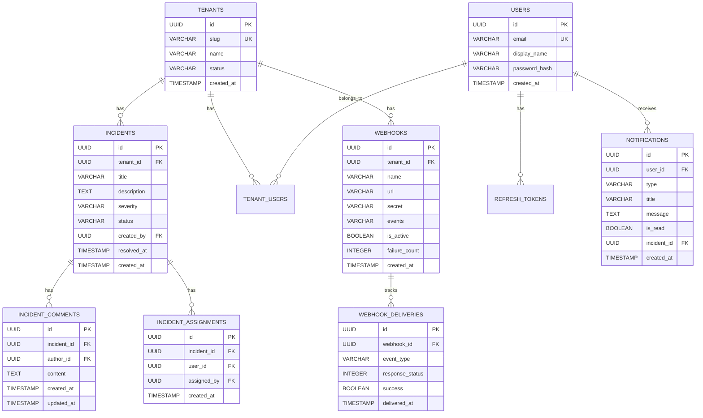

<p align="center">
  
  
  
  
  
  
</p>

<h1 align="center">🚨 Incident Alerting Platform</h1>

<p align="center">
  <strong>Enterprise-Grade Multi-Tenant Incident Management System</strong>
</p>

<p align="center">
  A production-ready, scalable incident management platform built with <b>Clean Architecture</b> principles.<br/>
  Designed for organizations to track, manage, and resolve incidents with real-time notifications and webhook integrations.
</p>

---

## 📋 Table of Contents

- [Overview](#-overview)
- [Key Features](#-key-features)
- [Architecture](#-architecture)
- [Tech Stack](#-tech-stack)
- [Getting Started](#-getting-started)
- [API Documentation](#-api-documentation)
- [Database Design](#-database-design)
- [Project Structure](#-project-structure)
- [Testing](#-testing)
- [Security](#-security)
- [Future Roadmap](#-future-roadmap)

---

## 🎯 Overview

The **Incident Alerting Platform** is a comprehensive solution for managing incidents across multiple organizations (tenants). It provides complete incident lifecycle management from creation to resolution, with features like:

- **Multi-tenancy** — Complete data isolation between organizations
- **Real-time Notifications** — Keep teams informed instantly
- **Webhook Integration** — Connect with external tools (Slack, PagerDuty, etc.)
- **Advanced Analytics** — Insights into incident patterns and resolution times
- **Role-Based Access Control** — Fine-grained permissions (Owner, Admin, Member)

### 🎬 Use Cases

| Scenario | How the Platform Helps |
|----------|----------------------|
| **DevOps Team** | Track production incidents, assign on-call engineers, measure MTTR |
| **IT Help Desk** | Manage support tickets, escalate critical issues, notify stakeholders |
| **Security Team** | Log security incidents, track remediation, audit trail via webhooks |
| **SaaS Provider** | Multi-tenant support for multiple client organizations |

---

## ✨ Key Features

### 🔐 Authentication & Authorization
- JWT-based authentication with refresh token rotation
- Secure password hashing with BCrypt
- Role-based access control (RBAC) per tenant
- Token blacklisting for secure logout

### 📊 Incident Management
- Full CRUD operations with status workflow
- Severity levels: `LOW`, `MEDIUM`, `HIGH`, `CRITICAL`
- Status tracking: `OPEN` → `IN_PROGRESS` → `RESOLVED` → `CLOSED`
- Rich incident details with timestamps and audit trail

### 💬 Collaboration
- **Comments** — Team discussions on incidents with edit/delete support
- **Assignments** — Assign incidents to team members with notifications
- **Mentions** — Tag team members in comments (planned)

### 🔔 Notifications
- In-app notification system
- Multiple notification types (Assignment, Status Change, Comments, Escalation)
- Read/unread tracking with bulk operations
- Notification cleanup for old records

### 🔗 Webhook Integration
- Configurable webhooks per tenant
- Event-driven triggers (Incident Created, Updated, Resolved, etc.)
- **HMAC-SHA256 signature verification** for security
- Delivery tracking with retry support
- Auto-disable after consecutive failures

### 📈 Analytics & Reporting
- Real-time incident statistics
- **Mean Time To Resolution (MTTR)** calculation
- Severity and status distribution charts
- Trend analysis over time periods
- Creator-based incident metrics

### 🔍 Search & Filtering
- Full-text search across incidents
- Filter by status, severity, date range
- Sorting options (newest, oldest, priority)
- Pagination support

---

## 🏗 Architecture

This project follows **Hexagonal Architecture** (Ports & Adapters) combined with **Domain-Driven Design (DDD)** principles:

```
┌─────────────────────────────────────────────────────────────────┐
│                        API Layer (REST)                         │
│  Controllers • DTOs • Request/Response Mapping • Validation     │
└─────────────────────────────────────────────────────────────────┘
                              │
                              ▼
┌─────────────────────────────────────────────────────────────────┐
│                     Application Layer                           │
│     Use Cases • Services • Business Logic • Orchestration       │
└─────────────────────────────────────────────────────────────────┘
                              │
              ┌───────────────┼───────────────┐
              ▼               ▼               ▼
┌──────────────────┐ ┌──────────────┐ ┌──────────────────┐
│   Domain Layer   │ │    Ports     │ │ Infrastructure   │
│                  │ │ (Interfaces) │ │    Layer         │
│ • Entities       │ │              │ │                  │
│ • Value Objects  │ │ • Repository │ │ • JPA Adapters   │
│ • Domain Logic   │ │   Interfaces │ │ • Security       │
│ • Enums          │ │              │ │ • External APIs  │
└──────────────────┘ └──────────────┘ └──────────────────┘
```

### Why This Architecture?

| Benefit | Description |
|---------|-------------|
| **Testability** | Business logic isolated from frameworks, easy to unit test |
| **Flexibility** | Swap databases or frameworks without touching core logic |
| **Maintainability** | Clear boundaries make code easier to understand and modify |
| **Scalability** | Components can be scaled or replaced independently |

---

## 🛠 Tech Stack

### Backend
| Technology | Purpose |
|------------|---------|
| **Java 21** | Latest LTS with virtual threads support |
| **Spring Boot 3.5.9** | Production-ready framework |
| **Spring Security** | Authentication & authorization |
| **Spring Data JPA** | Database abstraction |
| **Hibernate 6** | ORM with PostgreSQL optimizations |

### Database & Storage
| Technology | Purpose |
|------------|---------|
| **PostgreSQL 16** | Primary database with JSONB support |
| **Flyway** | Database version control (8 migrations) |
| **HikariCP** | High-performance connection pooling |

### Infrastructure
| Technology | Purpose |
|------------|---------|
| **Docker & Docker Compose** | Containerization |
| **Maven** | Build automation |
| **JUnit 5 + Mockito** | Testing framework |

### Security
| Technology | Purpose |
|------------|---------|
| **JWT (JSON Web Tokens)** | Stateless authentication |
| **BCrypt** | Password hashing |
| **HMAC-SHA256** | Webhook signature verification |

---

## 🚀 Getting Started

### Prerequisites
- Java 21 or higher
- Docker & Docker Compose
- Maven 3.9+ (or use included wrapper)

### Quick Start

```bash
# 1. Clone the repository
git clone https://github.com/mostafa2742002/incident-alerting-platform.git
cd incident-alerting-platform

# 2. Start PostgreSQL with Docker
docker-compose up -d

# 3. Run the application
./mvnw spring-boot:run

# 4. Access the API
curl http://localhost:8081/api/public/tenants
```

### Environment Configuration

```properties
# Database
spring.datasource.url=jdbc:postgresql://localhost:15432/incident_platform
spring.datasource.username=admin
spring.datasource.password=admin

# JWT Configuration
jwt.secret=your-256-bit-secret-key
jwt.expiration=3600000
jwt.refresh-expiration=604800000
```

### Docker Compose Services

```yaml
services:
  postgres:
    image: postgres:16-alpine
    ports:
      - "15432:5432"
    environment:
      POSTGRES_DB: incident_platform
      POSTGRES_USER: admin
      POSTGRES_PASSWORD: admin
```

---

## 📚 API Documentation

### Authentication Endpoints

| Method | Endpoint | Description |
|--------|----------|-------------|
| `POST` | `/api/public/auth/login` | User login, returns JWT + refresh token |
| `POST` | `/api/public/auth/refresh` | Refresh access token |
| `POST` | `/api/public/auth/logout` | Revoke refresh token |

### Tenant Management

| Method | Endpoint | Description |
|--------|----------|-------------|
| `POST` | `/api/public/tenants` | Create new tenant (signup) |
| `GET` | `/api/public/tenants/{id}` | Get tenant by ID |

### Incident Operations

| Method | Endpoint | Description |
|--------|----------|-------------|
| `POST` | `/api/public/tenants/{tenantId}/incidents` | Create incident |
| `GET` | `/api/public/tenants/{tenantId}/incidents` | List all incidents |
| `GET` | `/api/public/tenants/{tenantId}/incidents/{id}` | Get incident by ID |
| `PUT` | `/api/public/tenants/{tenantId}/incidents/{id}` | Update incident |
| `DELETE` | `/api/public/tenants/{tenantId}/incidents/{id}` | Delete incident |
| `PUT` | `/api/public/tenants/{tenantId}/incidents/{id}/status` | Change status |
| `PUT` | `/api/public/tenants/{tenantId}/incidents/{id}/resolve` | Resolve incident |
| `GET` | `/api/public/tenants/{tenantId}/incidents/search` | Search incidents |
| `GET` | `/api/public/tenants/{tenantId}/incidents/count` | Count incidents |

### Comments

| Method | Endpoint | Description |
|--------|----------|-------------|
| `POST` | `/api/public/tenants/{tenantId}/incidents/{incidentId}/comments` | Add comment |
| `GET` | `/api/public/tenants/{tenantId}/incidents/{incidentId}/comments` | List comments |
| `PUT` | `/api/public/tenants/{tenantId}/incidents/{incidentId}/comments/{id}` | Update comment |
| `DELETE` | `/api/public/tenants/{tenantId}/incidents/{incidentId}/comments/{id}` | Delete comment |

### Assignments

| Method | Endpoint | Description |
|--------|----------|-------------|
| `POST` | `/api/public/tenants/{tenantId}/incidents/{incidentId}/assignments` | Assign user |
| `GET` | `/api/public/tenants/{tenantId}/incidents/{incidentId}/assignments` | List assignees |
| `DELETE` | `/api/public/tenants/{tenantId}/incidents/{incidentId}/assignments/{userId}` | Unassign user |

### Notifications

| Method | Endpoint | Description |
|--------|----------|-------------|
| `GET` | `/api/public/notifications/user/{userId}` | Get user notifications |
| `GET` | `/api/public/notifications/user/{userId}/unread` | Get unread notifications |
| `GET` | `/api/public/notifications/user/{userId}/unread/count` | Count unread |
| `PUT` | `/api/public/notifications/{id}/read` | Mark as read |
| `PUT` | `/api/public/notifications/user/{userId}/read-all` | Mark all as read |

### Webhooks

| Method | Endpoint | Description |
|--------|----------|-------------|
| `POST` | `/api/public/tenants/{tenantId}/webhooks` | Create webhook |
| `GET` | `/api/public/tenants/{tenantId}/webhooks` | List webhooks |
| `GET` | `/api/public/tenants/{tenantId}/webhooks/{id}` | Get webhook |
| `PUT` | `/api/public/tenants/{tenantId}/webhooks/{id}` | Update webhook |
| `DELETE` | `/api/public/tenants/{tenantId}/webhooks/{id}` | Delete webhook |
| `POST` | `/api/public/tenants/{tenantId}/webhooks/{id}/test` | Test webhook |
| `GET` | `/api/public/tenants/{tenantId}/webhooks/{id}/deliveries` | Delivery history |

### Analytics

| Method | Endpoint | Description |
|--------|----------|-------------|
| `GET` | `.../incidents/analytics` | Full analytics dashboard |
| `GET` | `.../incidents/analytics/severity-distribution` | By severity |
| `GET` | `.../incidents/analytics/mttr` | Mean time to resolution |
| `GET` | `.../incidents/analytics/open-rate` | Open incident rate |
| `GET` | `.../incidents/analytics/by-creator` | Incidents by creator |

---

## 🗄 Database Design

### Entity Relationship Diagram



### Database Migrations

| Version | Description |
|---------|-------------|
| V1 | Initial tenants table |
| V2 | Users, roles, membership, refresh tokens |
| V3 | Tenant user role constraints |
| V4 | Incidents table |
| V5 | Incident comments |
| V6 | Incident assignments |
| V7 | Notifications |
| V8 | Webhooks and deliveries |

---

## 📁 Project Structure

```
src/
├── main/
│   ├── java/com/example/incidentplatform/
│   │   ├── api/                          # API Layer
│   │   │   ├── controller/               # REST Controllers (10 controllers)
│   │   │   └── dto/                      # Data Transfer Objects
│   │   │
│   │   ├── application/                  # Application Layer
│   │   │   ├── port/                     # Repository Interfaces (Ports)
│   │   │   ├── service/                  # Business Services (9 services)
│   │   │   └── usecase/                  # Use Case Implementations
│   │   │
│   │   ├── domain/                       # Domain Layer
│   │   │   └── model/                    # Domain Entities
│   │   │       ├── incident/             # Incident, Comment, Assignment
│   │   │       ├── notification/         # Notification, NotificationType
│   │   │       ├── tenant/               # Tenant, TenantUser
│   │   │       ├── user/                 # User, Role
│   │   │       └── webhook/              # Webhook, WebhookDelivery
│   │   │
│   │   ├── infrastructure/               # Infrastructure Layer
│   │   │   ├── persistence/
│   │   │   │   ├── adapter/              # JPA Repository Adapters
│   │   │   │   ├── entity/               # JPA Entities
│   │   │   │   ├── mapper/               # Entity ↔ Domain Mappers
│   │   │   │   └── repository/           # Spring Data JPA Repositories
│   │   │   └── security/                 # JWT, BCrypt, Security Config
│   │   │
│   │   └── common/                       # Shared Components
│   │       └── error/                    # Global Exception Handling
│   │
│   └── resources/
│       ├── application.properties        # Configuration
│       └── db/migration/                 # Flyway Migrations (8 files)
│
└── test/
    └── java/                             # 157+ Unit Tests
        └── com/example/incidentplatform/
            ├── api/controller/           # Controller Tests
            ├── application/service/      # Service Tests
            └── domain/model/             # Domain Tests
```

---

## 🧪 Testing

### Test Coverage

```
Total Tests: 157+
├── Service Layer Tests      ~70 tests
├── Controller Layer Tests   ~60 tests
├── Domain Model Tests       ~15 tests
└── Integration Tests        ~12 tests
```

### Running Tests

```bash
# Run all tests
./mvnw test

# Run specific test class
./mvnw test -Dtest=IncidentServiceTest

# Run with coverage report
./mvnw test jacoco:report
```

### Test Philosophy

- **Unit Tests** — Business logic in isolation with mocked dependencies
- **Integration Tests** — API endpoints with real database (Testcontainers)
- **Test Naming** — Descriptive names: `methodName_condition_expectedResult`

---

## 🔒 Security

### Authentication Flow

```
┌──────────┐    Login     ┌──────────┐    JWT Token    ┌──────────┐
│  Client  │ ──────────▶  │  Server  │ ──────────────▶ │  Client  │
└──────────┘              └──────────┘                 └──────────┘
     │                          │                           │
     │    Access Protected      │                           │
     │    Resource + JWT        │                           │
     │ ◀────────────────────────┼───────────────────────────┤
     │                          │                           │
     │                    Validate JWT                      │
     │                    Return Data                       │
     │ ◀────────────────────────┤                           │
```

### Security Features

| Feature | Implementation |
|---------|---------------|
| Password Hashing | BCrypt with strength 10 |
| JWT Tokens | Access (1h) + Refresh (7d) |
| Token Rotation | New refresh token on each refresh |
| Webhook Security | HMAC-SHA256 signatures |
| SQL Injection | Prevented via JPA parameterized queries |
| XSS Protection | Input validation on all endpoints |

---

## 🗺 Future Roadmap

- [ ] **Escalation Policies** — Automated incident escalation based on time/severity
- [ ] **Email Notifications** — SMTP integration for email alerts
- [ ] **Slack Integration** — Native Slack app for notifications
- [ ] **Audit Logging** — Complete audit trail for compliance
- [ ] **API Rate Limiting** — Protect against abuse
- [ ] **OpenAPI/Swagger UI** — Interactive API documentation
- [ ] **Kubernetes Deployment** — Helm charts for K8s
- [ ] **Metrics & Monitoring** — Prometheus + Grafana dashboards

---

## 👨‍💻 Author

**Mostafa** — Backend Developer

- GitHub: [@mostafa2742002](https://github.com/mostafa2742002)

---

## 📄 License

This project is licensed under the MIT License - see the [LICENSE](LICENSE) file for details.

---

<p align="center">
  <sub>Built with ❤️ using Spring Boot and Clean Architecture principles</sub>
</p>
